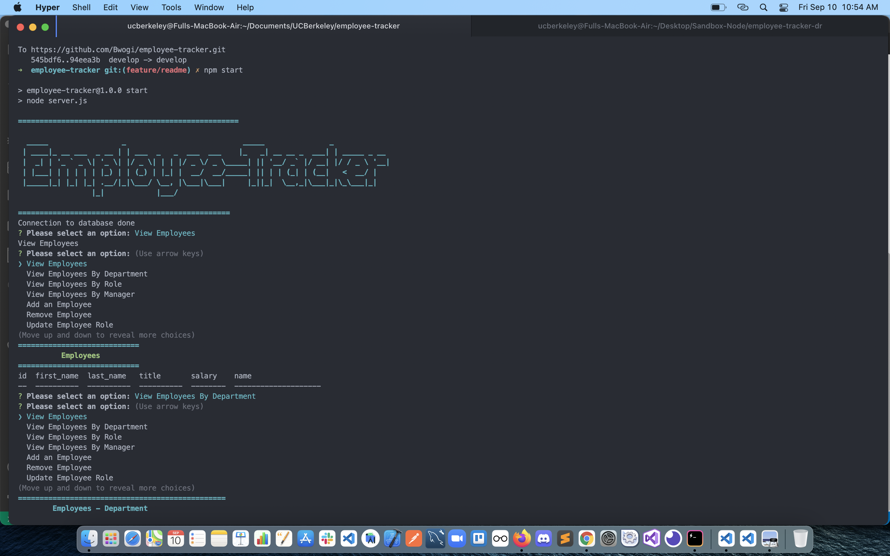

# employee-tracker  
  <p align="left">
    
    
    
       
  </p>

  ## Description
 This is a command line application to be used to manage employees in a company using Node.js, inquirer and MySQL.

  ## Packages used
  node, inquirer, console.table, mysql2, figlet

  ## Starting point - database schema
   

  ## Installation
  ```$ npm i mysql2 inquirer console.table figlet```

  ## Starting the mysql server
  With your own database credentials;
  ``` $ mysql -u <your username> -p ```
   ##  Usage
  ```$ npm start ```
  ## License 
  [](https://opensource.org/licenses/MIT)<br />
  This app is covered under MIT license.
  
  ## Screenshot
   
  ## Demo
  Find the [demo here on youtube.](https://youtu.be/MiY-PcK8FZI)
  ## Project repository 
  https://github.com/bwogi/employee-tracker
  ## Contributors
  Developed by Andrew Bwogi